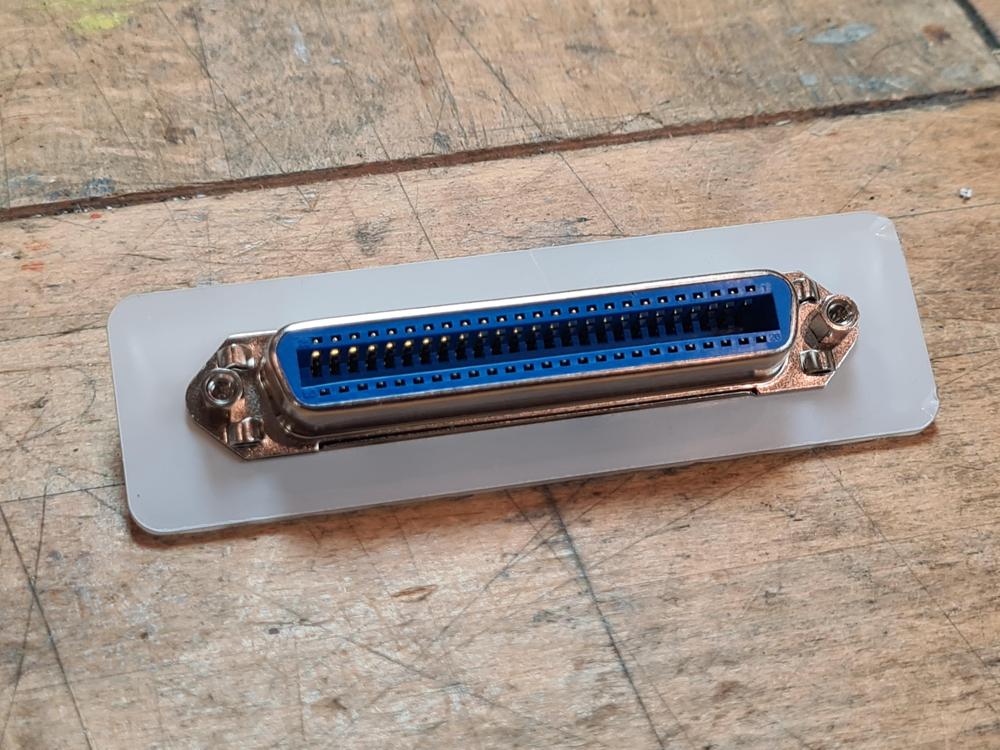
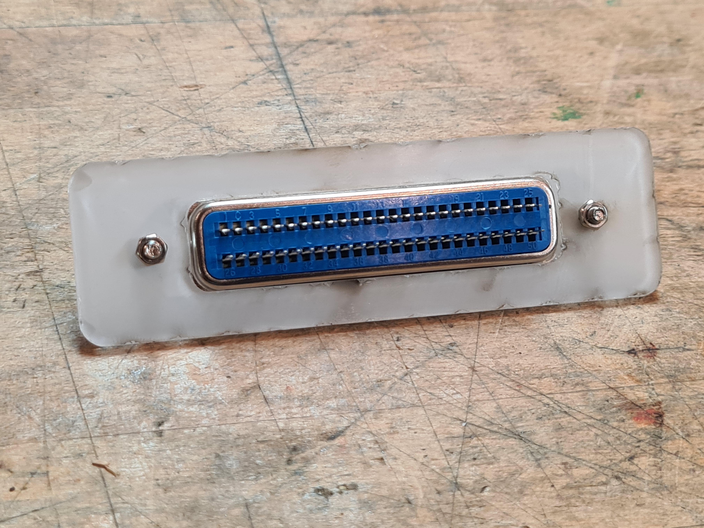
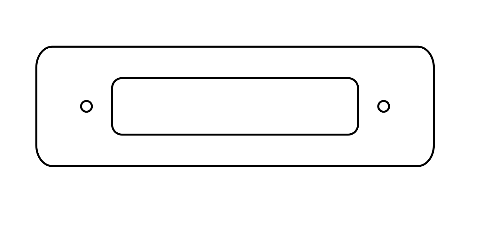

# Centronics 50 Pin RJ21 Bezel

A bezel for a Centronics 50 Pin / RJ21 Connector. The eBay seller lists this model as a "EB67Q"

The purpose of the bezel is to hide the probably untidy hole you've cut in the panel to mount the socket.

## Images

Front:  

Rear:  

SVG:  

## Licence

This project is licensed under the [Creative Commons CC BY-NC-SA 4.0](https://creativecommons.org/licenses/by-nc-sa/4.0/) licence.

You are free to share and adapt the code as required, however you *must* give appropriate credit and indicate what changes have been made. You must also distribute your adaptation under the same license. Commercial use is prohibited.

## Acknowledgements

Thanks to the [London Hackspace](https://london.hackspace.org.uk/) for use of the Laser Cutter.
